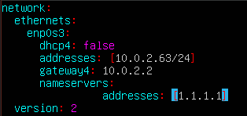
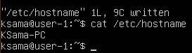
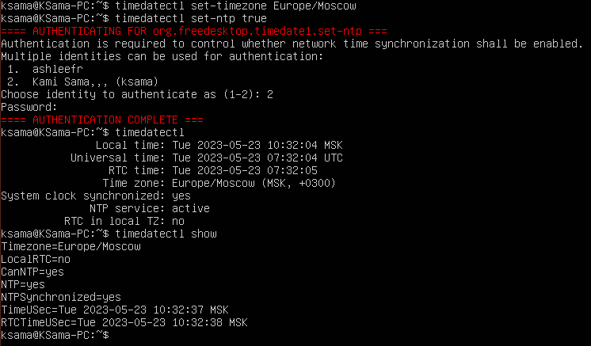
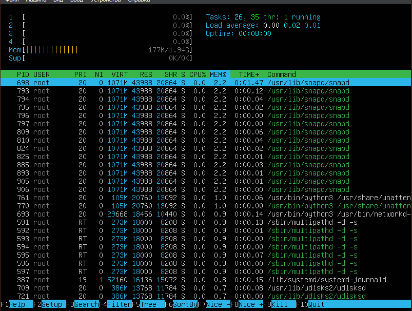

## Part 1. Установка ОС

- Установить **Ubuntu 20.04 Server LTS** без графического интерфейса. (Используем программу для виртуализации - VirtualBox)

- Графический интерфейс должен отсутствовать.

- Узнайте версию Ubuntu, выполнив команду
`cat /etc/issue.`

## Part 2. Создание пользователя

- Создать пользователя, отличного от пользователя, который создавался при установке. Пользователь должен быть добавлен в группу adm.

- Вставьте скриншот вызова команды для создания пользователя.

- Пользователь должен быть добавлен в группу adm.

- Новый пользователь должен быть в выводе команды  cat /etc/passwd

## Part 3. Настройка сети ОС

- Задать название машины вида user-1

- Установить временную зону, соответствующую вашему текущему местоположению.

- Вывести названия сетевых интерфейсов с помощью консольной команды.

- lo (loopback device) – виртуальный интерфейс, присутствующий по умолчанию в любом Linux. Он используется для отладки сетевых программ и запуска серверных приложений на локальной машине. С этим интерфейсом всегда связан адрес 127.0.0.1. У него есть dns-имя – localhost. Посмотреть привязку можно в файле /etc/hosts.

- Используя консольную команду получить ip адрес устройства, на котором вы работаете, от DHCP сервера.

- DHCP (англ. Dynamic Host Configuration Protocol — протокол динамической настройки узла) — прикладной протокол, позволяющий сетевым устройствам автоматически получать IP-адрес и другие параметры, необходимые для работы в сети TCP/IP. 

- Определить и вывести на экран внешний ip-адрес шлюза (ip) и внутренний IP-адрес шлюза, он же ip-адрес по умолчанию (gw).

- Задать статичные (заданные вручную, а не полученные от DHCP сервера) настройки ip, gw, dns (использовать публичный DNS серверы, например 1.1.1.1 или 8.8.8.8).

- Убедиться, что статичные сетевые настройки (ip, gw, dns) соответствуют заданным в предыдущем пункте.

- Успешно пропинговать удаленные хосты 1.1.1.1 и ya.ru и вставить в отчёт скрин с выводом команды. В выводе команды должна быть фраза "0% packet loss".

## Part 4. Обновление ОС

- Обновить системные пакеты до последней на момент выполнения задания версии. После обновления системных пакетов, если ввести команду обновления повторно, должно появится сообщение, что обновления отсутствуют.

## Part 5. Использование команды sudo

- Разрешить пользователю, созданному в Part 2, выполнять команду sudo. sudo дает пользователю права суперпользователяю

- Поменять hostname ОС от имени пользователя, созданного в пункте Part 2 (используя sudo).

## Part 6. Установка и настройка службы времени

- Настроить службу автоматической синхронизации времени. Вывести время, часового пояса, в котором вы сейчас находитесь. Вывод следующей команды должен содержать NTPSynchronized=yes: 
timedatectl show

## Part 7. Установка и использование текстовых редакторов

- Установить текстовые редакторы VIM (+ любые два по желанию NANO, MCEDIT, JOE и т.д.)

- Используя каждый из трех выбранных редакторов, создайте файл test_X.txt, где X -- название редактора, в котором создан файл. Напишите в нём свой никнейм, закройте файл с сохранением изменений.

- Используя каждый из трех выбранных редакторов, откройте файл на редактирование, отредактируйте файл, заменив никнейм на строку "21 School 21", закройте файл без сохранения изменений.

- Используя каждый из трех выбранных редакторов, отредактируйте файл ещё раз (по аналогии с предыдущим пунктом), а затем освойте функции поиска по содержимому файла (слово) и замены слова на любое другое.

### Сохранение
- vim - :wq
- nano - ctrl+x, yes
- micro - option+g, ctrl+x, yes

### Без сохранения
- vim - :q!
- nano - ctr+x, no
- micro - option+g, ctrl+x, no

### Поиск и замена
- vim - :%s/  /  
- nano - ctrl+/ 
- micro - option+g, ctrl+E, replace

## Part 8. Установка и базовая настройка сервиса SSHD

- Установить службу SSHd.

- Добавить автостарт службы при загрузке системы.

- Перенастроить службу SSHd на порт 2022.

- Используя команду ps, показать наличие процесса sshd.

Утилита ps одна из самых простых и в то же время часто используемых программ для просмотра списка процессов в Linux. -a - выбрать все процессы, кроме фоновых; -u - выбрать процессы пользователя; -x - При отображении процессов, соответствующих другим параметрам, включите процессы, у которых нет управляющего терминала. Это противоположность опции -X. Если в одной команде указаны и -X, и -x, то ps будет использовать тот, который был указан последним.

- Вывод команды netstat -tan должен содержать  
tcp 0 0 0.0.0.0:2022 0.0.0.0:* LISTEN 

Программа netstat показывает статус сети, команда -t отображает список соединения TCP, -a показывает список всех портов, -n отображает в числовом формате, не отображая имя хоста
адресс 0.0.0.0 используется в сети как немаршрутизируемый адрес IPv4, он используется во время инициализации системы, когда устройство использует его до того, как ему будет назначен реальный IP-адррес, в качестве адреса по умолчанию.

## Part 9. Установка и использование утилит top, htop

- Установить и запустить утилиты top и htop.

- uptime = 2 min
- количество авторизованных пользователей = 1 user
- общую загрузку системы = load average 0,07 0,10 0,04
- общее количество процессов = task = 127
- загрузку cpu = 0.0
- загрузку памяти Mem 1982.7
- pid процесса занимающего больше всего памяти 1
- pid процесса, занимающего больше всего процессорного времени 1

- В отчёт вставить скрин с выводом команды htop:
	- отсортированному по PID, PERCENT_CPU, PERCENT_MEM, TIME
  
	

	

	

	
  
	- отфильтрованному для процесса sshd
  
	
  
	- с процессом syslog, найденным, используя поиск 
  
	
  
	- с добавленным выводом hostname, clock и uptime
	
	

## Part 10. Использование утилиты fdisk

- Запустить команду sudo fdisk -l.

- название жесткого диска /dev/sda
- размер 5 GiB
- количество секторов 10485760

## Part 11. Использование утилиты df

- Запустить команду df.

- размер раздела 3273108
- размер занятого пространства 2557428
- размер свободного пространства 529108
- процент использования 83
- Определить и написать в отчёт единицу измерения в выводе - килобайт.

- Запустить команду df -Th.

- размер раздела 3.2G
- размер занятого пространства 2.5G
- размер свободного пространства 517M
- процент использования 83
- Определить и написать в отчёт тип файловой системы для раздела -  ext4.

## Part 12. Использование утилиты du

- Запустить команду du.

- Вывести размер папок /home, /var, /var/log (в байтах, в человекочитаемом виде)

- Вывести размер всего содержимого в /var/log (не общее, а каждого вложенного элемента, используя *)

## Part 13. Установка и использование утилиты ncdu

- Установить утилиту ncdu.

## Part 14. Работа с системными журналами

- Открыть для просмотра: /var/log/dmesg /var/log/syslog /var/log/auth.log

- Написать в отчёте время последней успешной авторизации, имя пользователя и метод входа в систему.

- Перезапустить службу SSHd. Вставить в отчёт скрин с сообщением о рестарте службы (искать в логах).

## Part 15. Использование планировщика заданий CRON

- Используя планировщик заданий, запустите команду uptime через каждые 2 минуты.

- Вывести на экран список текущих заданий для CRON.

- Вставить в отчёт скрины со строчками о выполнении и списком текущих задач.

- Удалите все задания из планировщика заданий. В отчёт вставьте скрин со списком текущих заданий для CRON.

